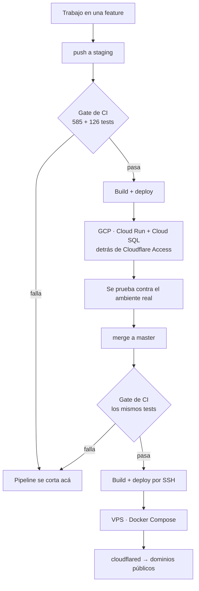

[English](./README.md) | Español

# Güau

[](https://github.com/joaoboy89/guau/actions/workflows/docker.yml)

Marketplace de paseo de perros para Capital Federal y Gran Buenos Aires, Argentina. Conecta dueños de mascotas con paseadores verificados — reserva, pago y (en construcción) seguimiento GPS en tiempo real.

**Estado del proyecto:** MVP en producción, beta cerrada — primera transacción real procesada y validada (dinero real, split de MercadoPago verificado). `master` es producción y deploya en vivo en cada push; todo cambio llega primero a una rama `staging` con su propio pipeline en GCP, se prueba contra un ambiente real, y recién después se considera para `master`.

---

## Decisiones técnicas y trade-offs

Ningún stack se elige gratis. Estas son las decisiones más importantes de este proyecto, con lo que gané y lo que sacrifiqué en cada una.

---

**1. Búsqueda por cercanía con Haversine en SQL crudo, no PostGIS**

Para buscar paseadores por zona uso la fórmula de Haversine en una query parametrizada de Prisma (`$queryRaw`), en vez de instalar PostGIS.

*Por qué:* PostGIS es la respuesta "correcta" para geoespacial serio, pero agrega una extensión que complica la imagen de Postgres, las migraciones y los backups — para resolver un problema que a esta escala no tengo. Haversine sobre una tabla con lat/lng indexadas responde en milisegundos con cientos o miles de paseadores.

*El costo:* sin índices espaciales reales, la query degrada con decenas de miles de filas, y no hay operaciones geo avanzadas (polígonos, rutas). Si el producto escala a ese punto, migrar a PostGIS es un camino conocido — y ese problema sería una buena noticia.

---

**2. Split de pagos directo de MercadoPago, no modelo colector**

Cuando un dueño paga un paseo, la plata va directo a la cuenta de MercadoPago del paseador (conectada por OAuth), y la comisión de Güau se separa automáticamente vía `marketplace_fee`. La plataforma nunca custodia fondos.

*Por qué:* el modelo alternativo (cobrar todo Güau y liquidar semanalmente a los paseadores) da más control, pero convierte a la plataforma en custodio de dinero ajeno: más carga fiscal, más responsabilidad legal, y construir toda una liquidación que MercadoPago ya resuelve. Para validar un negocio, menos piezas que puedan fallar.

*El costo:* menos control del flujo de fondos — un reembolso, por ejemplo, requiere ejecutar el refund contra el pago del paseador (la API de MP lo permite con el token OAuth de la plataforma) en vez de simplemente no liquidar. Validé el split completo end-to-end en **producción, con dinero real** (no sandbox): en un paseo de $3000, el dueño pagó de verdad y el split se ejecutó tal cual estaba diseñado — comisión Güau $450 (15% exacto), comisión MP $129,09 (~4,3% con IVA), neto acreditado al paseador $2.420,91. Verificado en logs de producción (webhook entregado en 3,7 segundos) y en los números reales de la base de datos, no en el estimado.

---

**3. Webhook con el token del vendedor + job de reconciliación como respaldo**

El webhook de pagos consulta el pago con el token OAuth del paseador (no con el de la plataforma), y un cron cada 15 minutos reconcilia pagos que el webhook no haya entregado.

*Por qué (lo aprendí de la peor manera):* en pagos de marketplace, consultar un pago del vendedor con el token de la plataforma devuelve 404 — está documentado, pero es fácil pasarlo por alto. Y en **sandbox** comprobé que la entrega de webhooks de MP no es confiable ahí: pagos reales aprobados que nunca dispararon la notificación, con el endpoint funcionando (verificado con curl firmado y con el simulador de MP). Un sistema de pagos no puede depender de una entrega "best effort" solo porque en sandbox funcionó mal una vez: el webhook quedó como vía rápida y el cron como garantía, con idempotencia para que el mismo pago procesado por ambos caminos no se acredite dos veces.

*El costo:* hasta 15 minutos de latencia en el peor caso si el webhook falla, y la complejidad extra del job. A cambio, ningún pago aprobado queda sin acreditar. **En producción, hasta ahora, el webhook siempre llegó y se procesó correctamente** (el primer pago real se acreditó en 3,7 segundos, y un reenvío duplicado de MP fue correctamente ignorado por el guard de idempotencia) — el cron es la garantía que sostiene la promesa, no un parche a un problema activo.

---

**4. JWT en cookies httpOnly, no localStorage**

Los tokens de sesión viven en cookies `httpOnly` (secure, sameSite lax), no en `localStorage`. Las strategies de Passport y el handshake del socket extraen el token de la cookie.

*Por qué:* `localStorage` es legible por cualquier JavaScript que corra en la página — un solo XSS y el atacante se lleva la sesión. La cookie httpOnly es invisible para JS por diseño. La migración no fue gratis: hubo que tocar backend (cookies en login/refresh/logout, nuevo `GET /auth/me`), frontend (sacar toda lectura de tokens) y el gateway de sockets.

*El costo:* CSRF pasa a ser un vector a considerar (mitigado con sameSite y CORS restringido), y el debugging es menos directo. En el camino apareció un bug real: el interceptor de axios trataba el 401 esperado de `/auth/me` como token vencido y generaba un loop infinito de recarga en el login — lo diagnostiqué con la pestaña Network de DevTools y quedó cubierto por un test de regresión.

---

**5. El staging llegó después que producción — misma decisión, revisada cuando cambió lo que había en juego**

Al principio, cada push a `master` deployaba directo a producción, sin ningún ambiente intermedio. Era un solo desarrollador validando un negocio sin usuarios reales todavía: un staging duplica infraestructura, secretos y mantenimiento para proteger contra un riesgo que, en ese momento, no existía de verdad. El riesgo real en esa etapa era no iterar rápido — así que puse la protección donde rendía: la suite completa (585 tests de backend + 126 de frontend) corriendo como gate en CI, bloqueando cualquier push con tests rotos antes de que llegara a producción.

*Qué cambió:* empezó a circular dinero real por la plataforma, y una paseadora real pasó por el onboarding. El costo que había aceptado a propósito en ese momento —"un bug que los tests no atrapen llega a usuarios reales"— dejó de ser teórico en el momento en que hubo una persona real y plata real del otro lado de ese bug.

*Qué hay hoy:* una rama `staging` con su propio pipeline hacia Google Cloud Platform (Cloud Run + Cloud SQL), cerrada detrás de Cloudflare Access y un Worker que usa Workload Identity Federation — sin ninguna key de service account descargable en toda esa cadena (más detalle en la sección *Ambiente de staging* más abajo). Todo cambio va primero a `staging`, se prueba contra un ambiente real, y recién después se considera para `master`. `master` sigue siendo producción y sigue deployando en vivo en cada push — esa mitad de la decisión original no cambió.

*El costo, medido contra la factura real de GCP, no supuesto:* Cloud SQL más Cloud Run para un ambiente sin tráfico real rondan los **$60 USD/mes** — Cloud SQL solo, la única pieza que nunca escala a cero, es el 77% de eso. Para comparar, el VPS que corre *toda* la producción cuesta **$7-10 USD/mes**. Dos pipelines para mantener, cada secreto duplicado en dos lugares, y entre seis y ocho veces el costo de infraestructura de la propia producción, para proteger un ambiente que hoy no tiene un solo usuario propio. Vale la pena ahora que hay una transacción real y una persona real del otro lado de un error; no hubiera valido la pena el primer día.

---

**6. Config de dinero que revienta al arrancar, no que falla en silencio**

La comisión del marketplace (`MP_MARKETPLACE_FEE`) se valida en el constructor de `WalksService`: si el valor no es una fracción entre 0 y 1, la API entera se niega a arrancar — no solo el módulo de pagos.

*Por qué:* una auditoría detectó que el `.env.example` sugería `10` (semántica de porcentaje) mientras el código esperaba `0.15` (fracción). Con el valor equivocado, la comisión de un paseo de $3000 hubiera sido $45.000 y el neto del paseador, negativo — sin ningún error visible. La pregunta real no era "¿validar o no?" (obvio que sí), sino cuánto radio de impacto tolerar cuando la validación falla: como NestJS arma todas las dependencias de forma sincrónica al bootear, un error en ese constructor tira la API completa — login, perfiles, chat, todo — no solo pagos. Elegí esa opción, simple y sin mecanismo extra, en vez de construir un "kill switch" que aísle el fallo solo a los endpoints de pago — patrón que sí uso en otro lado del mismo sistema: `MP_WEBHOOK_SECRET` se valida en el momento de la request, no al bootear, así que un webhook mal configurado no se lleva puesto el login ni el chat.

*El costo:* un typo en una sola variable de entorno tira toda la API, no solo el flujo de pagos. Es un costo real, aceptado a propósito: con un solo desarrollador, el chequeo manual del `.env` antes de cada deploy que toca esta validación sale más barato que mantener un mecanismo de degradación parcial. Con más equipo, valdría la pena aislar ese radio de impacto.

---

## Stack

| Capa | Tecnología |
|------|-----------|
| Frontend | Next.js 14 (App Router) |
| Backend | NestJS |
| Base de datos | PostgreSQL + Prisma |
| Real-time | Socket.io |
| Pagos | MercadoPago Checkout Pro — split de marketplace (`marketplace_fee`), OAuth Connect del vendedor, webhook firmado, job de reconciliación, token del vendedor cifrado en reposo (AES-256-GCM) |
| Email | Resend |
| Auth | JWT + Refresh Tokens, en cookies `httpOnly` (no accesibles desde JS) |
| Testing | Jest (backend: 585 tests automatizados en los módulos de mayor riesgo — pagos, auth, búsqueda, reservas, panel de soporte, health check, control de acceso — incluyendo todo catch de un camino con plata que antes fallaba en silencio; frontend: 126 tests sobre el cliente API (clasificación de errores de sesión, regresión del loop de auth), la lógica pura del panel de soporte (búsqueda, señales, línea de tiempo), utilidades de fechas y un test de componente renderizado) |
| Deploy | VPS propio + Docker Compose + Cloudflare Tunnel |
| CI/CD | GitHub Actions (push a `master` → tests → build → deploy automático) |
| Monorepo | npm workspaces + Turborepo |

## Estado actual

Implementado y funcionando: registro y auth completos (cookies httpOnly, sin tokens accesibles desde JavaScript), perfil de dueño y paseador (incluida carga de zona de trabajo por geolocalización), búsqueda de paseadores por cercanía, y un ciclo de vida de reserva completo a través de sus ocho estados reales (`PENDING → CONFIRMED → WALKER_ON_WAY → IN_PROGRESS → COMPLETED`, más `CANCELLED_OWNER`, `CANCELLED_WALKER` y `NOT_PERFORMED` para las reservas que no llegaron a hacerse) — sostenido por un job que corre cada 5 minutos para detectar reservas que quedaron trabadas en un callejón sin salida (nunca confirmadas, paseador que nunca apareció, nadie actuó) y resolverlas solo. Dos mecanismos anti-fraude protegen la entrega misma: la dirección exacta del punto de encuentro queda ofuscada para el paseador (un punto aleatorio dentro de ~200m, determinístico por reserva) hasta que aprieta "voy en camino", y arrancar un paseo hoy exige un código de 4 dígitos que el dueño entrega en persona — un código que nunca llega al dispositivo del paseador — así que "el paseo arrancó" deja de ser la palabra de una sola parte contra la otra. El chat in-app en tiempo real entre dueño y paseador (Socket.io) queda acotado a la ventana activa de la reserva — se habilita cuando el paseador marca "voy en camino" y la propia API lo cierra cuando el paseo cierra (403 pasado ese punto, no una convención del front) — con un filtro de datos de contacto en dos niveles: un mail, un @handle o una corrida de 8 o más dígitos de teléfono bloquea el mensaje directamente, mientras que solo mencionar un canal ("no tengo WhatsApp") no bloquea, queda marcado para el registro nomás. Notificaciones in-app en tiempo real (campana con badge de no leídas, vía Socket.io sobre el Cloudflare Tunnel, verificado en producción), y 585 tests automatizados de backend más 126 de frontend cubriendo los módulos de mayor riesgo (pagos, auth, búsqueda, reservas, administración, panel de soporte, cifrado, control de acceso).

Un panel de soporte de solo lectura (`/support`) le permite a un admin buscar una reserva y diagnosticar un reclamo sin escribir nada: por código corto de la reserva, mail de cualquiera de las dos partes, o rango de fechas — sin ningún filtro no devuelve nada, a propósito, y ese corte pasa antes de tocar la base, no filtrando un resultado grande después. La vista del caso separa lo pactado (los términos de la reserva) de lo ocurrido (una línea de tiempo real armada con timestamps) y muestra solo las anomalías — arrancó sin código, lo cerró el dueño en vez del paseador, inicio tardío — en vez de listar unos 25 campos con el mismo peso. Leer el chat de una reserva es una acción aparte y deliberada de abrir el caso, y cada lectura deja una línea de log: quién miró qué, cuándo. Es la primera rebanada, de solo lectura, a propósito — todavía no escribe nada.

Pago vía MercadoPago: **split de marketplace validado end-to-end en producción, con dinero real**. El dueño paga y el monto se reparte automáticamente entre el paseador (vía OAuth Connect de su propia cuenta de MercadoPago) y Güau (`marketplace_fee`). Primera transacción real: un paseo de $3000 dividido en comisión de Güau ($450, 15% exacto), comisión de MercadoPago ($129,09, ~4,3% con IVA) y neto acreditado al paseador ($2.420,91) — verificado contra logs de producción y los números reales de la base de datos. Incluye webhook que consulta el pago con las credenciales del vendedor (entregado en 3,7 segundos en ese primer pago real), job de reconciliación periódico como respaldo (ningún sistema de pagos serio depende de un solo canal de notificación), procesamiento idempotente (un reenvío duplicado de MercadoPago fue correctamente ignorado), y el `mpAccessToken` del paseador **cifrado en reposo (AES-256-GCM)** y nunca expuesto en respuestas HTTP.

Pendiente: integración de mapas (Mapbox ya está instalado, falta conectarlo), upload de fotos (Cloudflare R2), tracking GPS en vivo del lado del dueño, notificaciones push de navegador, ampliar cobertura de tests de frontend.

## Estructura del monorepo

```
guau/
├── apps/
│   ├── web/       # Next.js — frontend
│   └── api/       # NestJS — backend
├── packages/
│   └── shared/    # Tipos TypeScript compartidos entre web y api
├── infra/vps/     # docker-compose.yml de producción + script de deploy manual
└── .github/workflows/  # CI/CD
```

## Correr el proyecto en local

Requisitos: Node 20+, npm 10+, Docker (para la base de datos local).

```bash
# 1. Clonar e instalar dependencias (workspaces — un solo install para todo)
npm install

# 2. Levantar Postgres local (puerto 5433, no pisa un Postgres del sistema)
docker compose -f docker-compose.dev.yml up -d

# 3. Configurar variables de entorno
# Cada app tiene su .env.example con todos los placeholders necesarios.
cp apps/api/.env.example apps/api/.env
cp apps/web/.env.example apps/web/.env.local
# Completar con los valores reales en cada archivo (claves JWT, tokens de MercadoPago,
# Mapbox, Resend, etc.). El DATABASE_URL ya viene listo para el contenedor local
#   (el contenedor publica en el puerto 5433 del host — usá 5433, no 5432,
#   desde una app corriendo fuera de Docker).

# 4. Migrar y sembrar datos
cd apps/api
npm run prisma:migrate
npm run prisma:seed

# 5. Levantar todo (desde la raíz del repo)
npm run dev   # corre web (puerto 3000) y api (puerto 3001) en paralelo, vía Turborepo
```

Backend disponible en `http://localhost:3001`, con Swagger en `http://localhost:3001/docs` (sin Basic Auth en desarrollo — la protección solo aplica cuando `NODE_ENV=production`). Frontend en `http://localhost:3000`.

## Tests

```bash
# Backend — 585 tests (Jest)
cd apps/api && npm test

# Frontend — 126 tests (Jest vía next/jest)
cd apps/web && npm test
```

Cobertura enfocada en los módulos de mayor riesgo (pagos, autenticación, búsqueda de paseadores, ciclo de vida de una reserva, panel de administración, panel de soporte) en vez de perseguir 100% de líneas — CRUD simple sin lógica de negocio queda sin cubrir a propósito.

## Variables de entorno

Cada app tiene un `.env.example` con el formato esperado y placeholders para todos los valores:

- `apps/api/.env.example` → copiar a `apps/api/.env`
- `apps/web/.env.example` → copiar a `apps/web/.env.local`

Los valores reales (tokens de MercadoPago, claves JWT, API keys de Resend, etc.) no se versionan — pedir por canal privado.

## Deploy y CI/CD



Cada `push` a `master` dispara `.github/workflows/docker.yml`: construye las imágenes de `api` y `web`, las publica en GitHub Container Registry, y se conecta por SSH al VPS de producción para bajarlas y levantar los contenedores con Docker Compose. El deploy de producción es directo — lo que se pushea a `master` queda en producción en 2-3 minutos. Vale ser preciso con algo que el diagrama de arriba no muestra: pasar primero por staging es una regla que sigo, no un mecanismo que este workflow imponga. `docker.yml` no tiene forma de chequear por dónde estuvo un commit; staging corre en su propia rama, con su propio pipeline, descrito abajo.

El pipeline corre los tests (backend + frontend) antes de buildear — si algo falla, el deploy no se ejecuta. Las migraciones se aplican solas: el entrypoint del contenedor de la API corre `prisma migrate deploy` en cada arranque, antes de levantar la app — una migración nueva viaja dentro de la imagen y se aplica automáticamente al deployar, sin paso manual.

Backups diarios de Postgres a Cloudflare R2 con retención de 30 días, vía `infra/vps/backup-db.sh` (cron 4:00 AM en el VPS). Restore documentado en `infra/vps/restore-db.sh`.

La conexión al VPS público es únicamente a través de un túnel de Cloudflare. Los puertos de los contenedores están atados a `127.0.0.1` (no accesibles desde la IP pública), y el firewall del proveedor solo permite entrada por SSH — verificado con pruebas reales de conexión externa, no asumido. Acceso SSH solo por clave (autenticación por contraseña deshabilitada), con `fail2ban` activo.

### Ambiente de staging

Un segundo ambiente en Google Cloud Platform (Cloud Run + Cloud SQL) espeja producción para validar cambios antes de que lleguen a usuarios reales — se deploya desde su propia rama y su propio pipeline, totalmente desacoplado del VPS.

Los servicios de Cloud Run ahí son IAM-only: no aceptan tráfico público directo. Una capa de Cloudflare Access por delante maneja el login humano (SSO por código de un solo uso vía email), y un Cloudflare Worker a medida hace de puente de identidad hacia GCP usando **Workload Identity Federation** — el Worker firma su propio JWT de corta duración y lo canjea por un token de Google con audiencia específica, en cada request. No existe ninguna key de service account descargable en ningún punto de esa cadena, lo que elimina una credencial de larga vida que de otro modo habría que guardar y rotar.

## Monitoreo

Tres capas, tres preguntas distintas — ninguna reemplaza a la otra.

**¿Está viva la app?** UptimeRobot ya le pega al front cada 5 minutos desde afuera de la infraestructura; la API ahora tiene su propio `GET /health` para el mismo chequeo. Devuelve exactamente `{"status":"ok"}`, o un 503 con `{"status":"degraded"}` — nada más. Sin versión, sin entorno, sin uptime, sin versión de Postgres: un health check hablador le regala a un atacante el inventario para ir a buscar vulnerabilidades conocidas. Pega en la base de verdad con un `SELECT 1` en vez de solo confirmar que el proceso está vivo — un health check que nunca toca la base prueba menos que un endpoint de negocio cualquiera. Con su propio límite (30/min), más estricto que el throttler global.

**¿Hizo lo que tenía que hacer el job programado?** El backup diario de Postgres corre adentro del servidor a las 4 AM, sin ninguna URL para consultar desde afuera. healthchecks.io funciona como un dead man's switch: el job le pega un ping al terminar, y la *ausencia* de ese ping — no un reporte de falla — es la alerta. Verificado de punta a punta, no supuesto: una corrida manual movió el `Last Ping` de "Never" a 59 segundos, y — chequeado por primera vez — el dump resultó ser restaurable de verdad: `pg_restore --list` sobre un dump real listó 89 entradas de tabla en formato CUSTOM de Postgres. El script ahora también valida el dump (tamaño mínimo, más la firma `PGDMP`) antes de subirlo y antes de pingear éxito — un dump de 0 bytes se subía y pingeaba éxito exactamente igual que uno real.

**¿Qué se rompió con la app viva?** Sentry, en la API y en el navegador.

Dos decisiones que vale la pena nombrar aparte. PII: `sendDefaultPii: false`, más un hook `beforeSend` que recorre el evento entero y reemplaza cualquier campo llamado `password`, `token`, `accessToken` o `mpAccessToken` a cualquier profundidad, y borra las cookies y el header `Authorization` directamente — Güau guarda mails, teléfonos y direcciones de casas, y el `mpAccessToken` de un paseador no tiene que salir del backend nunca, sin excepción. Sin Session Replay, ni siquiera comentado: grabaría la pantalla de alguien mientras escribe su dirección. Los datos quedan alojados en la Unión Europea, elegido a propósito: la UE está en el listado de países con protección adecuada de la AAIP argentina (Ley 25.326) y Estados Unidos no, así que evita un trámite de transferencia internacional directamente.

Qué se reporta, y por qué: los 4xx nunca llegan a Sentry, y es estructural, no una comparación de status pegada en algún lado — `HttpExceptionFilter` le gana a cualquier excepción esperada antes de que el filtro de Sentry la vea siquiera. El matiz que lo hace correcto de verdad: "`HttpException`" no es sinónimo de "4xx" (`InternalServerErrorException` es un 5xx y sigue siendo `HttpException`), así que el filtro chequea el status directamente y reporta él mismo cualquier cosa `>= 500`. Aparte: un `catch` que solo loguea es un error que alguien decidió ocultar — cuatro lugares que hacían exactamente eso en caminos con plata (el webhook de MercadoPago, el job de reconciliación, un fallo al desencriptar un token, el mail de alerta de plata expuesta) ahora reportan de forma explícita, sin ningún otro cambio de comportamiento.

La mejor prueba de que funciona no es una afirmación, es un resultado: minutos después de quedar configurado, Sentry encontró un bug real que nadie estaba buscando — un cron de recordatorios que abortaba la corrida entera, mandando cero recordatorios, apenas fallaba una sola query a la base, sin dejar rastro en ningún otro lado.

---

Proyecto privado — ver [`LICENSE`](./LICENSE). Código visible con fines de portfolio y evaluación técnica; no licenciado para uso comercial o redistribución.
