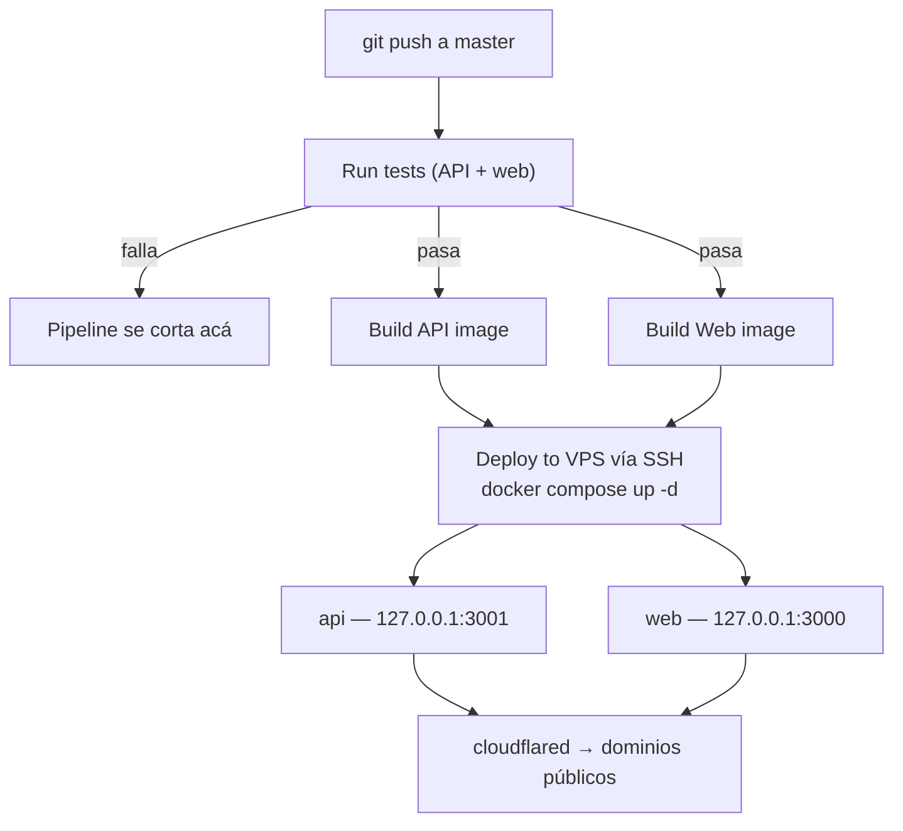

[English](./README.md) | Español

# Güau

[](https://github.com/joaoboy89/guau/actions/workflows/docker.yml)

Marketplace de paseo de perros para Capital Federal y Gran Buenos Aires, Argentina. Conecta dueños de mascotas con paseadores verificados — reserva, pago y (en construcción) seguimiento GPS en tiempo real.

**Estado del proyecto:** pre-MVP, en beta cerrada de desarrollo. `master` es producción — no hay ambiente de staging.

<!-- SCREENSHOTS: pending — se agregan mañana -->

---

## Decisiones técnicas y trade-offs

Ningún stack se elige gratis. Estas son las decisiones más importantes de este proyecto, con lo que gané y lo que sacrifiqué en cada una.

---

**1. Búsqueda por cercanía con Haversine en SQL crudo, no PostGIS**

Para buscar paseadores por zona uso la fórmula de Haversine en una query parametrizada de Prisma (`$queryRaw`), en vez de instalar PostGIS.

*Por qué:* PostGIS es la respuesta "correcta" para geoespacial serio, pero agrega una extensión que complica la imagen de Postgres, las migraciones y los backups — para resolver un problema que a esta escala no tengo. Haversine sobre una tabla con lat/lng indexadas responde en milisegundos con cientos o miles de paseadores.

*El costo:* sin índices espaciales reales, la query degrada con decenas de miles de filas, y no hay operaciones geo avanzadas (polígonos, rutas). Si el producto escala a ese punto, migrar a PostGIS es un camino conocido — y ese problema sería una buena noticia.

---

**2. Split de pagos directo de MercadoPago, no modelo colector**

Cuando un dueño paga un paseo, la plata va directo a la cuenta de MercadoPago del paseador (conectada por OAuth), y la comisión de Güau se separa automáticamente vía `marketplace_fee`. La plataforma nunca custodia fondos.

*Por qué:* el modelo alternativo (cobrar todo Güau y liquidar semanalmente a los paseadores) da más control, pero convierte a la plataforma en custodio de dinero ajeno: más carga fiscal, más responsabilidad legal, y construir toda una liquidación que MercadoPago ya resuelve. Para validar un negocio, menos piezas que puedan fallar.

*El costo:* menos control del flujo de fondos — un reembolso, por ejemplo, requiere ejecutar el refund contra el pago del paseador (la API de MP lo permite con el token OAuth de la plataforma) en vez de simplemente no liquidar. Validé el split completo end-to-end en **producción, con dinero real** (no sandbox): en un paseo de $3000, el dueño pagó de verdad y el split se ejecutó tal cual estaba diseñado — comisión Güau $450 (15% exacto), comisión MP $129,09 (~4,3% con IVA), neto acreditado al paseador $2.420,91. Verificado en logs de producción (webhook entregado en 3,7 segundos) y en los números reales de la base de datos, no en el estimado.

---

**3. Webhook con el token del vendedor + job de reconciliación como respaldo**

El webhook de pagos consulta el pago con el token OAuth del paseador (no con el de la plataforma), y un cron cada 15 minutos reconcilia pagos que el webhook no haya entregado.

*Por qué (lo aprendí de la peor manera):* en pagos de marketplace, consultar un pago del vendedor con el token de la plataforma devuelve 404 — está documentado, pero es fácil pasarlo por alto. Y en **sandbox** comprobé que la entrega de webhooks de MP no es confiable ahí: pagos reales aprobados que nunca dispararon la notificación, con el endpoint funcionando (verificado con curl firmado y con el simulador de MP). Un sistema de pagos no puede depender de una entrega "best effort" solo porque en sandbox funcionó mal una vez: el webhook quedó como vía rápida y el cron como garantía, con idempotencia para que el mismo pago procesado por ambos caminos no se acredite dos veces.

*El costo:* hasta 15 minutos de latencia en el peor caso si el webhook falla, y la complejidad extra del job. A cambio, ningún pago aprobado queda sin acreditar. **En producción, hasta ahora, el webhook siempre llegó y se procesó correctamente** (el primer pago real se acreditó en 3,7 segundos, y un reenvío duplicado de MP fue correctamente ignorado por el guard de idempotencia) — el cron es la garantía que sostiene la promesa, no un parche a un problema activo.

---

**4. JWT en cookies httpOnly, no localStorage**

Los tokens de sesión viven en cookies `httpOnly` (secure, sameSite lax), no en `localStorage`. Las strategies de Passport y el handshake del socket extraen el token de la cookie.

*Por qué:* `localStorage` es legible por cualquier JavaScript que corra en la página — un solo XSS y el atacante se lleva la sesión. La cookie httpOnly es invisible para JS por diseño. La migración no fue gratis: hubo que tocar backend (cookies en login/refresh/logout, nuevo `GET /auth/me`), frontend (sacar toda lectura de tokens) y el gateway de sockets.

*El costo:* CSRF pasa a ser un vector a considerar (mitigado con sameSite y CORS restringido), y el debugging es menos directo. En el camino apareció un bug real: el interceptor de axios trataba el 401 esperado de `/auth/me` como token vencido y generaba un loop infinito de recarga en el login — lo diagnostiqué con la pestaña Network de DevTools y quedó cubierto por un test de regresión.

---

**5. `master` = producción, sin staging — pero con gate de tests en CI**

Cada push a `master` deploya a producción vía GitHub Actions. No hay entorno de staging.

*Por qué:* soy un solo desarrollador validando un negocio. Un staging duplica infra, secretos y mantenimiento para proteger... ¿de quién? El riesgo real en esta etapa es no iterar rápido. La protección la puse donde rinde: la suite completa (~210 tests de backend + frontend) corre como gate en CI antes de buildear y deployar — un push con tests rotos no llega a producción.

*El costo:* un bug que los tests no atrapen llega a usuarios reales. Lo acepto conscientemente mientras los usuarios se cuentan de a unos; staging entra al roadmap cuando haya tráfico que proteger.

---

**6. Config de dinero que revienta al arrancar, no que falla en silencio**

La comisión del marketplace (`MP_MARKETPLACE_FEE`) se valida en el constructor de `WalksService`: si el valor no es una fracción entre 0 y 1, la API entera se niega a arrancar — no solo el módulo de pagos.

*Por qué:* una auditoría detectó que el `.env.example` sugería `10` (semántica de porcentaje) mientras el código esperaba `0.15` (fracción). Con el valor equivocado, la comisión de un paseo de $3000 hubiera sido $45.000 y el neto del paseador, negativo — sin ningún error visible. La pregunta real no era "¿validar o no?" (obvio que sí), sino cuánto radio de impacto tolerar cuando la validación falla: como NestJS arma todas las dependencias de forma sincrónica al bootear, un error en ese constructor tira la API completa — login, perfiles, chat, todo — no solo pagos. Elegí esa opción, simple y sin mecanismo extra, en vez de construir un "kill switch" que aísle el fallo solo a los endpoints de pago — patrón que sí uso en otro lado del mismo sistema: `MP_WEBHOOK_SECRET` se valida en el momento de la request, no al bootear, así que un webhook mal configurado no se lleva puesto el login ni el chat.

*El costo:* un typo en una sola variable de entorno tira toda la API, no solo el flujo de pagos. Es un costo real, aceptado a propósito: con un solo desarrollador, el chequeo manual del `.env` antes de cada deploy que toca esta validación sale más barato que mantener un mecanismo de degradación parcial. Con más equipo, valdría la pena aislar ese radio de impacto.

---

## Stack

| Capa | Tecnología |
|------|-----------|
| Frontend | Next.js 14 (App Router) |
| Backend | NestJS |
| Base de datos | PostgreSQL + Prisma |
| Real-time | Socket.io |
| Pagos | MercadoPago Checkout Pro — split de marketplace (`marketplace_fee`), OAuth Connect del vendedor, webhook firmado, job de reconciliación, token del vendedor cifrado en reposo (AES-256-GCM) |
| Email | Resend |
| Auth | JWT + Refresh Tokens, en cookies `httpOnly` (no accesibles desde JS) |
| Testing | Jest (backend: 200+ tests automatizados en los módulos de mayor riesgo — pagos, auth, búsqueda, reservas, admin, cifrado, control de acceso; frontend: suites de Jest sobre el cliente API (regresión del loop de auth), el store de notificaciones y utilidades de fechas) |
| Deploy | VPS propio + Docker Compose + Cloudflare Tunnel |
| CI/CD | GitHub Actions (push a `master` → tests → build → deploy automático) |
| Monorepo | npm workspaces + Turborepo |

## Estado actual

Implementado y funcionando: registro y auth completos (cookies httpOnly, sin tokens accesibles desde JavaScript), perfil de dueño y paseador (incluida carga de zona de trabajo por geolocalización), búsqueda de paseadores por cercanía, flujo completo de reserva (crear → confirmar/rechazar → en curso → completado), notificaciones in-app en tiempo real (campana con badge de no leídas, vía Socket.io sobre el Cloudflare Tunnel, verificado en producción), y 200+ tests automatizados de backend cubriendo los módulos de mayor riesgo (pagos, auth, búsqueda, reservas, administración, cifrado, control de acceso).

Pago vía MercadoPago: **split de marketplace validado end-to-end en producción, con dinero real**. El dueño paga y el monto se reparte automáticamente entre el paseador (vía OAuth Connect de su propia cuenta de MercadoPago) y Güau (`marketplace_fee`). Primera transacción real: un paseo de $3000 dividido en comisión de Güau ($450, 15% exacto), comisión de MercadoPago ($129,09, ~4,3% con IVA) y neto acreditado al paseador ($2.420,91) — verificado contra logs de producción y los números reales de la base de datos. Incluye webhook que consulta el pago con las credenciales del vendedor (entregado en 3,7 segundos en ese primer pago real), job de reconciliación periódico como respaldo (ningún sistema de pagos serio depende de un solo canal de notificación), procesamiento idempotente (un reenvío duplicado de MercadoPago fue correctamente ignorado), y el `mpAccessToken` del paseador **cifrado en reposo (AES-256-GCM)** y nunca expuesto en respuestas HTTP.

Pendiente: integración de mapas (Mapbox ya está instalado, falta conectarlo), upload de fotos (Cloudflare R2), tracking GPS en vivo del lado del dueño, notificaciones push de navegador, ampliar cobertura de tests de frontend.

## Estructura del monorepo

```
guau/
├── apps/
│   ├── web/       # Next.js — frontend
│   └── api/       # NestJS — backend
├── packages/
│   └── shared/    # Tipos TypeScript compartidos entre web y api
├── infra/vps/     # docker-compose.yml de producción + script de deploy manual
├── docs/          # Blueprint técnico + pendientes + brand guide
└── .github/workflows/  # CI/CD
```

## Correr el proyecto en local

Requisitos: Node 20+, npm 10+, Docker (para la base de datos local).

```bash
# 1. Clonar e instalar dependencias (workspaces — un solo install para todo)
npm install

# 2. Levantar Postgres local (puerto 5433, no pisa un Postgres del sistema)
docker compose -f docker-compose.dev.yml up -d

# 3. Configurar variables de entorno
# Cada app tiene su .env.example con todos los placeholders necesarios.
cp apps/api/.env.example apps/api/.env
cp apps/web/.env.example apps/web/.env.local
# Completar con los valores reales en cada archivo (claves JWT, tokens de MercadoPago,
# Mapbox, Resend, etc.). El DATABASE_URL ya viene listo para el contenedor local
#   (el contenedor publica en el puerto 5433 del host — usá 5433, no 5432,
#   desde una app corriendo fuera de Docker).

# 4. Migrar y sembrar datos
cd apps/api
npm run prisma:migrate
npm run prisma:seed

# 5. Levantar todo (desde la raíz del repo)
npm run dev   # corre web (puerto 3000) y api (puerto 3001) en paralelo, vía Turborepo
```

Backend disponible en `http://localhost:3001`, con Swagger en `http://localhost:3001/docs` (sin Basic Auth en desarrollo — la protección solo aplica cuando `NODE_ENV=production`). Frontend en `http://localhost:3000`.

## Tests

```bash
# Backend — 200+ tests (Jest)
cd apps/api && npm test

# Frontend — Jest vía next/jest
cd apps/web && npm test
```

Cobertura enfocada en los módulos de mayor riesgo (pagos, autenticación, búsqueda de paseadores, ciclo de vida de una reserva, panel de administración) en vez de perseguir 100% de líneas — CRUD simple sin lógica de negocio queda sin cubrir a propósito.

## Variables de entorno

Cada app tiene un `.env.example` con el formato esperado y placeholders para todos los valores:

- `apps/api/.env.example` → copiar a `apps/api/.env`
- `apps/web/.env.example` → copiar a `apps/web/.env.local`

Los valores reales (tokens de MercadoPago, claves JWT, API keys de Resend, etc.) no se versionan — pedir por canal privado.

## Deploy y CI/CD



Cada `push` a `master` dispara `.github/workflows/docker.yml`: construye las imágenes de `api` y `web`, las publica en GitHub Container Registry, y se conecta por SSH al VPS de producción para bajarlas y levantar los contenedores con Docker Compose. Sin ambiente de staging — lo que se pushea a `master` queda en producción en 2-3 minutos.

El pipeline corre los tests (backend + frontend) antes de buildear — si algo falla, el deploy no se ejecuta. Las migraciones se aplican solas: el entrypoint del contenedor de la API corre `prisma migrate deploy` en cada arranque, antes de levantar la app — una migración nueva viaja dentro de la imagen y se aplica automáticamente al deployar, sin paso manual.

Backups diarios de Postgres a Cloudflare R2 con retención de 30 días, vía `infra/vps/backup-db.sh` (cron 4:00 AM en el VPS). Restore documentado en `infra/vps/restore-db.sh`.

La conexión al VPS público es únicamente a través de un túnel de Cloudflare. Los puertos de los contenedores están atados a `127.0.0.1` (no accesibles desde la IP pública), y el firewall del proveedor solo permite entrada por SSH — verificado con pruebas reales de conexión externa, no asumido. Acceso SSH solo por clave (autenticación por contraseña deshabilitada), con `fail2ban` activo.

## Documentación adicional

Existe una carpeta `docs/` con notas de arquitectura, modelo de datos y decisiones de producto — **es local, privada, y no forma parte de este repositorio** (`docs/` está en `.gitignore` a propósito). Si estás leyendo esto desde un clon del repo, esa carpeta no va a estar presente; este README es la referencia autosuficiente para levantar y entender el proyecto.

---

Proyecto privado — ver [`LICENSE`](./LICENSE). Código visible con fines de portfolio y evaluación técnica; no licenciado para uso comercial o redistribución.
