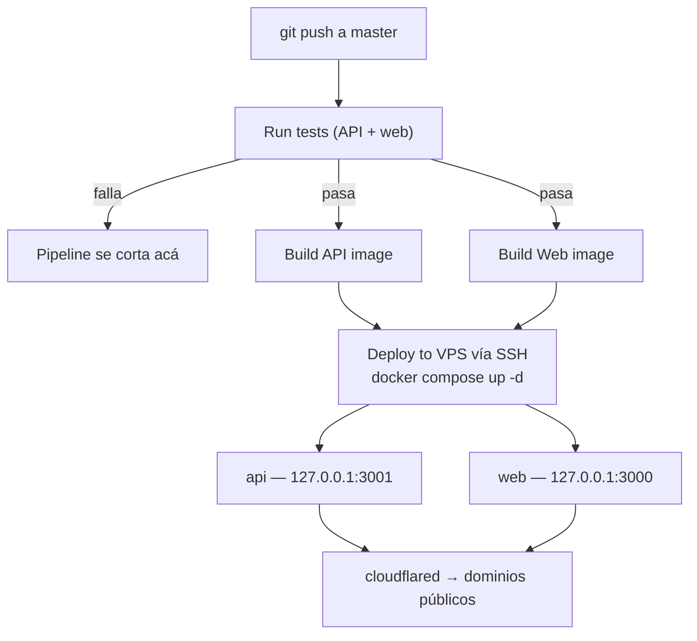

[English](./README.md) | Español

# Güau

[](https://github.com/joaoboy89/guau/actions/workflows/docker.yml)

Marketplace de paseo de perros para Capital Federal y Gran Buenos Aires, Argentina. Conecta dueños de mascotas con paseadores verificados — reserva, pago y (en construcción) seguimiento GPS en tiempo real.

**Estado del proyecto:** pre-MVP, en beta cerrada de desarrollo. `master` es producción — no hay ambiente de staging.

<!-- SCREENSHOTS: pending — se agregan mañana -->
<!-- TRADE-OFFS SECTION: pending — draft en docs/trade-offs-draft.md, se inserta mañana tras auditoría -->

---

## Stack

| Capa | Tecnología |
|------|-----------|
| Frontend | Next.js 14 (App Router) |
| Backend | NestJS |
| Base de datos | PostgreSQL + Prisma |
| Real-time | Socket.io |
| Pagos | MercadoPago Checkout Pro — split de marketplace (`marketplace_fee`), OAuth Connect del vendedor, webhook firmado, job de reconciliación, token del vendedor cifrado en reposo (AES-256-GCM) |
| Email | Resend |
| Auth | JWT + Refresh Tokens, en cookies `httpOnly` (no accesibles desde JS) |
| Testing | Jest (backend: 200+ tests automatizados en los módulos de mayor riesgo — pagos, auth, búsqueda, reservas, admin, cifrado, control de acceso; frontend: suites de Jest sobre el cliente API (regresión del loop de auth), el store de notificaciones y utilidades de fechas) |
| Deploy | VPS propio + Docker Compose + Cloudflare Tunnel |
| CI/CD | GitHub Actions (push a `master` → tests → build → deploy automático) |
| Monorepo | npm workspaces + Turborepo |

## Estado actual

Implementado y funcionando: registro y auth completos (cookies httpOnly, sin tokens accesibles desde JavaScript), perfil de dueño y paseador (incluida carga de zona de trabajo por geolocalización), búsqueda de paseadores por cercanía, flujo completo de reserva (crear → confirmar/rechazar → en curso → completado), notificaciones in-app en tiempo real (campana con badge de no leídas, vía Socket.io sobre el Cloudflare Tunnel, verificado en producción), y 200+ tests automatizados de backend cubriendo los módulos de mayor riesgo (pagos, auth, búsqueda, reservas, administración, cifrado, control de acceso).

Pago vía MercadoPago: **split de marketplace validado end-to-end en sandbox**. El dueño paga y el monto se reparte automáticamente entre el paseador (vía OAuth Connect de su propia cuenta de MercadoPago) y Güau (`marketplace_fee`), verificado con números reales — comisión de la plataforma, comisión de MercadoPago (con IVA) y neto al paseador cuadran desde las tres cuentas. Incluye webhook que consulta el pago con las credenciales del vendedor, job de reconciliación periódico como respaldo del webhook (ningún sistema de pagos serio depende de un solo canal de notificación), procesamiento idempotente, y el `mpAccessToken` del paseador **cifrado en reposo (AES-256-GCM)** y nunca expuesto en respuestas HTTP. Falta solo el cambio de credenciales de sandbox a producción para operar con dinero real.

Pendiente: integración de mapas (Mapbox ya está instalado, falta conectarlo), upload de fotos (Cloudflare R2), tracking GPS en vivo del lado del dueño, notificaciones push de navegador, ampliar cobertura de tests de frontend.

## Estructura del monorepo

```
guau/
├── apps/
│   ├── web/       # Next.js — frontend
│   └── api/       # NestJS — backend
├── packages/
│   └── shared/    # Tipos TypeScript compartidos entre web y api
├── infra/vps/     # docker-compose.yml de producción + script de deploy manual
├── docs/          # Blueprint técnico + pendientes + brand guide
└── .github/workflows/  # CI/CD
```

## Correr el proyecto en local

Requisitos: Node 20+, npm 10+, Docker (para la base de datos local).

```bash
# 1. Clonar e instalar dependencias (workspaces — un solo install para todo)
npm install

# 2. Levantar Postgres local (puerto 5433, no pisa un Postgres del sistema)
docker compose -f docker-compose.dev.yml up -d

# 3. Configurar variables de entorno
# Cada app tiene su .env.example con todos los placeholders necesarios.
cp apps/api/.env.example apps/api/.env
cp apps/web/.env.example apps/web/.env.local
# Completar con los valores reales en cada archivo (claves JWT, tokens de MercadoPago,
# Mapbox, Resend, etc.). El DATABASE_URL ya viene listo para el contenedor local
#   (el contenedor publica en el puerto 5433 del host — usá 5433, no 5432,
#   desde una app corriendo fuera de Docker).

# 4. Migrar y sembrar datos
cd apps/api
npm run prisma:migrate
npm run prisma:seed

# 5. Levantar todo (desde la raíz del repo)
npm run dev   # corre web (puerto 3000) y api (puerto 3001) en paralelo, vía Turborepo
```

Backend disponible en `http://localhost:3001`, con Swagger en `http://localhost:3001/docs` (sin Basic Auth en desarrollo — la protección solo aplica cuando `NODE_ENV=production`). Frontend en `http://localhost:3000`.

## Tests

```bash
# Backend — 200+ tests (Jest)
cd apps/api && npm test

# Frontend — Jest vía next/jest
cd apps/web && npm test
```

Cobertura enfocada en los módulos de mayor riesgo (pagos, autenticación, búsqueda de paseadores, ciclo de vida de una reserva, panel de administración) en vez de perseguir 100% de líneas — CRUD simple sin lógica de negocio queda sin cubrir a propósito.

## Variables de entorno

Cada app tiene un `.env.example` con el formato esperado y placeholders para todos los valores:

- `apps/api/.env.example` → copiar a `apps/api/.env`
- `apps/web/.env.example` → copiar a `apps/web/.env.local`

Los valores reales (tokens de MercadoPago, claves JWT, API keys de Resend, etc.) no se versionan — pedir por canal privado.

## Deploy y CI/CD



Cada `push` a `master` dispara `.github/workflows/docker.yml`: construye las imágenes de `api` y `web`, las publica en GitHub Container Registry, y se conecta por SSH al VPS de producción para bajarlas y levantar los contenedores con Docker Compose. Sin ambiente de staging — lo que se pushea a `master` queda en producción en 2-3 minutos.

El pipeline corre los tests (backend + frontend) antes de buildear — si algo falla, el deploy no se ejecuta. Importante: el pipeline de CI/CD **no ejecuta migraciones de Prisma automáticamente**. Si un cambio incluye una migración nueva, hay que correrla a mano en el VPS (o vía `infra/vps/deploy.sh`, que sí las corre) antes o después del deploy, según el caso.

Backups diarios de Postgres a Cloudflare R2 con retención de 30 días, vía `infra/vps/backup-db.sh` (cron 4:00 AM en el VPS). Restore documentado en `infra/vps/restore-db.sh`.

La conexión al VPS público es únicamente a través de un túnel de Cloudflare. Los puertos de los contenedores están atados a `127.0.0.1` (no accesibles desde la IP pública), y el firewall del proveedor solo permite entrada por SSH — verificado con pruebas reales de conexión externa, no asumido. Acceso SSH solo por clave (autenticación por contraseña deshabilitada), con `fail2ban` activo.

## Documentación adicional

Existe una carpeta `docs/` con notas de arquitectura, modelo de datos y decisiones de producto — **es local, privada, y no forma parte de este repositorio** (`docs/` está en `.gitignore` a propósito). Si estás leyendo esto desde un clon del repo, esa carpeta no va a estar presente; este README es la referencia autosuficiente para levantar y entender el proyecto.

---

Proyecto privado — ver [`LICENSE`](./LICENSE). Código visible con fines de portfolio y evaluación técnica; no licenciado para uso comercial o redistribución.
