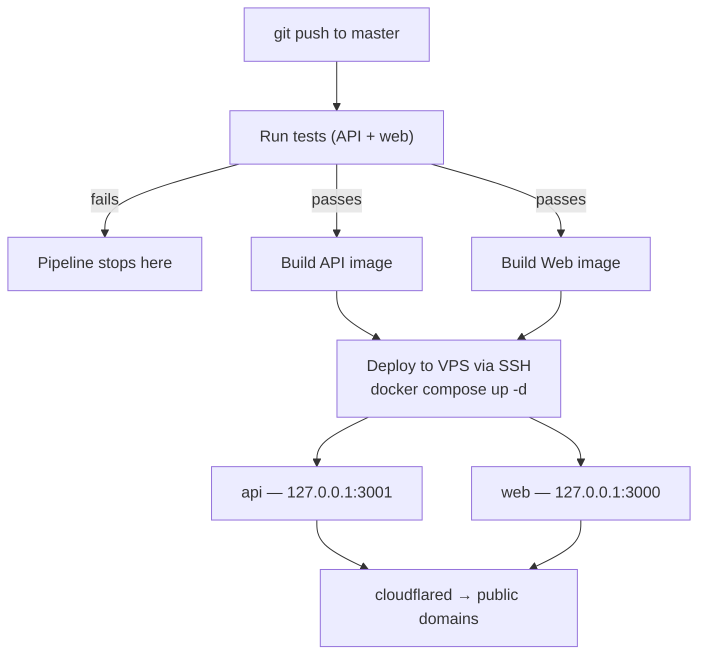

English | [Español](./README.es.md)

# Güau

[](https://github.com/joaoboy89/guau/actions/workflows/docker.yml)

Dog-walking marketplace for Buenos Aires (Capital Federal + Greater Buenos Aires), Argentina. Connects dog owners with verified walkers — booking, payments, and (in progress) live GPS tracking.

**Project status:** pre-MVP, closed development beta. `master` is production — there is no staging environment.

<!-- SCREENSHOTS: pending — se agregan mañana -->
<!-- TRADE-OFFS SECTION: pending — draft en docs/trade-offs-draft.md, se inserta mañana tras auditoría -->

---

## Stack

| Layer | Technology |
|-------|-----------|
| Frontend | Next.js 14 (App Router) |
| Backend | NestJS |
| Database | PostgreSQL + Prisma |
| Real-time | Socket.io |
| Payments | MercadoPago Checkout Pro — marketplace split (`marketplace_fee`), seller OAuth Connect, signed webhook, reconciliation job, seller access token encrypted at rest (AES-256-GCM) |
| Email | Resend |
| Auth | JWT + refresh tokens in `httpOnly` cookies (not accessible from JS) |
| Testing | Jest — backend: 200+ automated tests across the highest-risk modules (payments, auth, walker search, bookings, admin, encryption, access control); frontend: Jest suites over the API client (auth-refresh-loop regression), the notifications store, and date utilities |
| Deploy | Self-managed VPS + Docker Compose + Cloudflare Tunnel |
| CI/CD | GitHub Actions (push to `master` → test → build → automatic deploy) |
| Monorepo | npm workspaces + Turborepo |

## Current status

Implemented and working: full registration/auth (httpOnly cookies, no tokens accessible from JavaScript), owner and walker profiles (including work-zone setup via geolocation), proximity-based walker search, a complete booking flow (create → confirm/reject → in progress → completed), real-time in-app notifications (bell icon with unread badge, powered by Socket.io over the Cloudflare Tunnel, verified in production), and 200+ automated backend tests covering the highest-risk modules (payments, auth, search, bookings, admin, encryption, access control).

Payments via MercadoPago: **marketplace split validated end-to-end in sandbox**. The owner pays, and the amount is automatically split between the walker (via their own MercadoPago OAuth Connect) and Güau (`marketplace_fee`) — verified with real numbers, checked from all three accounts: platform commission, MercadoPago's own fee (with VAT), and the walker's net all reconcile. Includes a webhook that queries the payment using the seller's own credentials, a periodic reconciliation job as a backstop (no serious payments system should depend on a single notification channel), idempotent processing, and the walker's `mpAccessToken` **encrypted at rest (AES-256-GCM)** and never exposed in HTTP responses. The only thing left before handling real money is swapping sandbox credentials for production ones.

Pending: map integration (Mapbox is installed, not yet wired up), photo uploads (Cloudflare R2), live GPS tracking on the owner's side, browser push notifications, and broader frontend test coverage.

## Monorepo structure

```
guau/
├── apps/
│   ├── web/       # Next.js — frontend
│   └── api/       # NestJS — backend
├── packages/
│   └── shared/    # TypeScript types shared between web and api
├── infra/vps/     # production docker-compose.yml + manual deploy script
├── docs/          # technical blueprint + backlog + brand guide
└── .github/workflows/  # CI/CD
```

## Running locally

Requirements: Node 20+, npm 10+, Docker (for the local database).

```bash
# 1. Clone and install dependencies (workspaces — a single install for everything)
npm install

# 2. Start local Postgres (port 5433, won't collide with a system Postgres)
docker compose -f docker-compose.dev.yml up -d

# 3. Configure environment variables
# Each app has its own .env.example with all the placeholders you need.
cp apps/api/.env.example apps/api/.env
cp apps/web/.env.example apps/web/.env.local
# Fill in the real values in each file (JWT secrets, MercadoPago tokens,
# Mapbox, Resend, etc.). DATABASE_URL is already set up for the local container
#   (the container publishes on host port 5433 — use 5433, not 5432, from an
#   app running outside Docker).

# 4. Migrate and seed
cd apps/api
npm run prisma:migrate
npm run prisma:seed

# 5. Start everything (from the repo root)
npm run dev   # runs web (port 3000) and api (port 3001) in parallel, via Turborepo
```

Backend available at `http://localhost:3001`, with Swagger at `http://localhost:3001/docs` (no Basic Auth in development — that protection only kicks in when `NODE_ENV=production`). Frontend at `http://localhost:3000`.

## Tests

```bash
# Backend — 200+ tests (Jest)
cd apps/api && npm test

# Frontend — Jest via next/jest
cd apps/web && npm test
```

Coverage is focused on the highest-risk modules (payments, auth, walker search, booking lifecycle, admin panel) rather than chasing 100% line coverage — simple CRUD with no business logic is left uncovered on purpose.

## Environment variables

Each app has an `.env.example` with the expected format and placeholders for every value:

- `apps/api/.env.example` → copy to `apps/api/.env`
- `apps/web/.env.example` → copy to `apps/web/.env.local`

Real values (MercadoPago tokens, JWT secrets, Resend API keys, etc.) are not committed — ask over a private channel.

## Deploy & CI/CD



Every `push` to `master` triggers `.github/workflows/docker.yml`: it builds the `api` and `web` images, publishes them to the GitHub Container Registry, then connects over SSH to the production VPS to pull them and bring up the containers with Docker Compose. There's no staging environment — whatever gets pushed to `master` is live in production within 2-3 minutes.

The pipeline runs the tests (backend + frontend) before building — if anything fails, the deploy never runs. Important: the CI/CD pipeline does **not** run Prisma migrations automatically. If a change includes a new migration, it has to be run by hand on the VPS (or via `infra/vps/deploy.sh`, which does run them) before or after the deploy, depending on the case.

Daily Postgres backups to Cloudflare R2 with 30-day retention, via `infra/vps/backup-db.sh` (cron at 4:00 AM on the VPS). Restore documented in `infra/vps/restore-db.sh`.

The VPS is only reachable through a Cloudflare Tunnel. Container ports are bound to `127.0.0.1` (not reachable from the public IP), and the provider's firewall only allows inbound SSH — verified with real external connection tests, not assumed. SSH access is key-only (password auth disabled), with `fail2ban` active.

## Additional documentation

There's a `docs/` folder with architecture notes, data model, and product decisions — **it's local, private, and not part of this repository** (`docs/` is gitignored on purpose). If you're reading this from a clone of the repo, that folder won't be there; this README is meant to be the self-contained reference for running and understanding the project.

---

Private project — see [`LICENSE`](./LICENSE). Code visible for portfolio and technical-evaluation purposes; not licensed for commercial use or redistribution.
