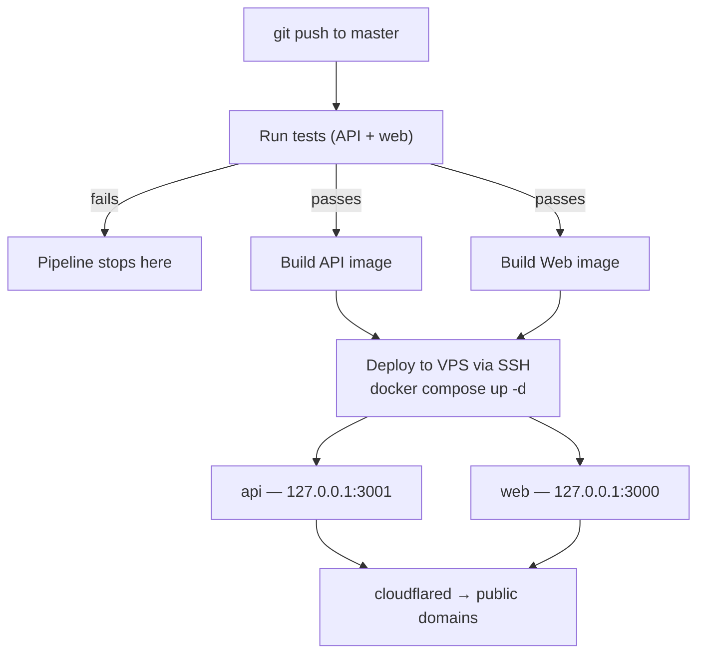

English | [Español](./README.es.md)

# Güau

[](https://github.com/joaoboy89/guau/actions/workflows/docker.yml)

Dog-walking marketplace for Buenos Aires (Capital Federal + Greater Buenos Aires), Argentina. Connects dog owners with verified walkers — booking, payments, and (in progress) live GPS tracking.

**Project status:** pre-MVP, closed development beta. `master` is production — there is no staging environment.

<!-- SCREENSHOTS: pending — se agregan mañana -->

---

## Technical decisions and trade-offs

No stack is free. These are the most important decisions in this project, what I gained and what I gave up on each one.

---

**1. Proximity search with Haversine in raw SQL, not PostGIS**

To search walkers by zone I use the Haversine formula in a parameterized Prisma query (`$queryRaw`), instead of installing PostGIS.

*Why:* PostGIS is the "correct" answer for serious geospatial work, but it adds an extension that complicates the Postgres image, migrations, and backups — to solve a problem I don't have at this scale. Haversine over a table with indexed lat/lng responds in milliseconds with hundreds or thousands of walkers.

*The cost:* without real spatial indexes, the query degrades past tens of thousands of rows, and there's no support for advanced geo operations (polygons, routes). If the product scales to that point, migrating to PostGIS is a well-known path — and that problem would be a good one to have.

---

**2. Direct MercadoPago payment split, not a collector model**

When an owner pays for a walk, the money goes straight to the walker's MercadoPago account (connected via OAuth), and Güau's commission is split off automatically via `marketplace_fee`. The platform never holds funds in custody.

*Why:* the alternative (Güau collects everything and settles with walkers weekly) gives more control, but turns the platform into a custodian of other people's money — more tax exposure, more legal liability, and an entire settlement system to build that MercadoPago already solves. Fewer moving parts that can break, while validating a business.

*The cost:* less control over the flow of funds — a refund, for example, has to be executed against the walker's payment (MercadoPago's API allows this with the platform's OAuth token) instead of simply withholding a payout. I validated the full split end-to-end in **production, with real money** (not sandbox): on a $3000 ARS walk, the owner paid for real and the split executed exactly as designed — Güau's commission $450 (exactly 15%), MercadoPago's fee $129.09 (~4.3% with VAT), walker's net payout $2,420.91. Verified against production logs (webhook delivered in 3.7 seconds) and the real database numbers, not the estimate.

---

**3. Webhook with the seller's token, plus a reconciliation job as a backstop**

The payment webhook queries the payment using the walker's OAuth token (not the platform's), and a cron job every 15 minutes reconciles any payment the webhook failed to deliver.

*Why (learned the hard way):* on marketplace payments, querying a seller's payment with the platform's token returns a 404 — it's documented, but easy to miss. And in **sandbox** I found MercadoPago's webhook delivery wasn't reliable there: real, approved payments that never triggered the notification, with the endpoint working fine (verified with a signed curl request and MercadoPago's own simulator). A payments system can't depend on "best effort" delivery just because it misbehaved once in sandbox — the webhook stayed as the fast path, and the cron became the guarantee, with idempotency so a payment processed through both paths never gets credited twice.

*The cost:* up to 15 minutes of latency in the worst case if the webhook fails, plus the extra complexity of the job. In exchange, no approved payment goes uncredited. **In production, so far, the webhook has always arrived and processed correctly** (the first real payment was credited in 3.7 seconds, and a duplicate resend from MercadoPago was correctly ignored by the idempotency guard) — the cron is the guarantee that backs the promise, not a patch for an active problem.

---

**4. JWT in httpOnly cookies, not localStorage**

Session tokens live in `httpOnly` cookies (secure, sameSite lax), not in `localStorage`. The Passport strategies and the socket handshake extract the token from the cookie.

*Why:* `localStorage` is readable by any JavaScript running on the page — one XSS and the attacker walks away with the session. An httpOnly cookie is invisible to JS by design. The migration wasn't free: it touched the backend (cookies on login/refresh/logout, a new `GET /auth/me`), the frontend (removing every token read), and the socket gateway.

*The cost:* CSRF becomes a vector to consider (mitigated with sameSite and restricted CORS), and debugging is less direct. Along the way, a real bug surfaced: the axios interceptor was treating the expected 401 from `/auth/me` as an expired token and triggering an infinite reload loop on the login screen — diagnosed with the DevTools Network tab, and now covered by a regression test.

---

**5. `master` is production, no staging — but with a test gate in CI**

Every push to `master` deploys to production via GitHub Actions. There's no staging environment.

*Why:* I'm a single developer validating a business. A staging environment duplicates infrastructure, secrets, and maintenance to protect against... whom? The real risk at this stage is not iterating fast enough. I put the protection where it actually pays off: the full test suite (~210 backend and frontend tests) runs as a gate in CI before building and deploying — a push with failing tests never reaches production.

*The cost:* a bug the tests don't catch reaches real users. I accept that consciously while the user base is still counted in single digits; staging joins the roadmap once there's real traffic to protect.

---

**6. Money config that crashes on boot instead of failing silently**

The marketplace commission (`MP_MARKETPLACE_FEE`) is validated inside `WalksService`'s constructor: if the value isn't a fraction between 0 and 1, the entire API refuses to start — not just the payments module.

*Why:* an audit found that `.env.example` suggested `10` (percentage semantics) while the code expected `0.15` (a fraction). With the wrong value, the commission on a $3000 walk would have been $45,000, and the walker's net payout, negative — with no visible error. The real question wasn't "should this be validated?" (obviously yes), but how much blast radius to accept when validation fails: since NestJS wires up all dependencies synchronously at boot, an error in that constructor takes down the whole API — login, profiles, chat, everything — not just payments. I chose that option, simple and with no extra machinery, over building a scoped "kill switch" that isolates the failure to payment endpoints only — a pattern I do use elsewhere in the same system: `MP_WEBHOOK_SECRET` is validated at request time, not at boot, so a misconfigured webhook secret doesn't take login or chat down with it.

*The cost:* a typo in a single environment variable takes down the entire API, not just the payment flow. That's a real cost, accepted on purpose: with one developer, manually checking the `.env` before any deploy that touches this validation is cheaper than maintaining a partial-degradation mechanism. With a bigger team, isolating that blast radius would be worth it.

---

## Stack

| Layer | Technology |
|-------|-----------|
| Frontend | Next.js 14 (App Router) |
| Backend | NestJS |
| Database | PostgreSQL + Prisma |
| Real-time | Socket.io |
| Payments | MercadoPago Checkout Pro — marketplace split (`marketplace_fee`), seller OAuth Connect, signed webhook, reconciliation job, seller access token encrypted at rest (AES-256-GCM) |
| Email | Resend |
| Auth | JWT + refresh tokens in `httpOnly` cookies (not accessible from JS) |
| Testing | Jest — backend: 200+ automated tests across the highest-risk modules (payments, auth, walker search, bookings, admin, encryption, access control); frontend: Jest suites over the API client (auth-refresh-loop regression), the notifications store, and date utilities |
| Deploy | Self-managed VPS + Docker Compose + Cloudflare Tunnel |
| CI/CD | GitHub Actions (push to `master` → test → build → automatic deploy) |
| Monorepo | npm workspaces + Turborepo |

## Current status

Implemented and working: full registration/auth (httpOnly cookies, no tokens accessible from JavaScript), owner and walker profiles (including work-zone setup via geolocation), proximity-based walker search, a complete booking flow (create → confirm/reject → in progress → completed), real-time in-app notifications (bell icon with unread badge, powered by Socket.io over the Cloudflare Tunnel, verified in production), and 200+ automated backend tests covering the highest-risk modules (payments, auth, search, bookings, admin, encryption, access control).

Payments via MercadoPago: **marketplace split validated end-to-end in production, with real money**. The owner pays, and the amount is automatically split between the walker (via their own MercadoPago OAuth Connect) and Güau (`marketplace_fee`). The first real transaction: a $3000 (ARS) walk split into Güau's commission ($450, exactly 15%), MercadoPago's own fee ($129.09, ~4.3% with VAT), and the walker's net payout ($2,420.91) — verified against production logs and the real database numbers. Includes a webhook that queries the payment using the seller's own credentials (delivered in 3.7 seconds on that first real payment), a periodic reconciliation job as a backstop (no serious payments system should depend on a single notification channel), idempotent processing (a duplicate webhook resend from MercadoPago was correctly ignored), and the walker's `mpAccessToken` **encrypted at rest (AES-256-GCM)** and never exposed in HTTP responses.

Pending: map integration (Mapbox is installed, not yet wired up), photo uploads (Cloudflare R2), live GPS tracking on the owner's side, browser push notifications, and broader frontend test coverage.

## Monorepo structure

```
guau/
├── apps/
│   ├── web/       # Next.js — frontend
│   └── api/       # NestJS — backend
├── packages/
│   └── shared/    # TypeScript types shared between web and api
├── infra/vps/     # production docker-compose.yml + manual deploy script
├── docs/          # technical blueprint + backlog + brand guide
└── .github/workflows/  # CI/CD
```

## Running locally

Requirements: Node 20+, npm 10+, Docker (for the local database).

```bash
# 1. Clone and install dependencies (workspaces — a single install for everything)
npm install

# 2. Start local Postgres (port 5433, won't collide with a system Postgres)
docker compose -f docker-compose.dev.yml up -d

# 3. Configure environment variables
# Each app has its own .env.example with all the placeholders you need.
cp apps/api/.env.example apps/api/.env
cp apps/web/.env.example apps/web/.env.local
# Fill in the real values in each file (JWT secrets, MercadoPago tokens,
# Mapbox, Resend, etc.). DATABASE_URL is already set up for the local container
#   (the container publishes on host port 5433 — use 5433, not 5432, from an
#   app running outside Docker).

# 4. Migrate and seed
cd apps/api
npm run prisma:migrate
npm run prisma:seed

# 5. Start everything (from the repo root)
npm run dev   # runs web (port 3000) and api (port 3001) in parallel, via Turborepo
```

Backend available at `http://localhost:3001`, with Swagger at `http://localhost:3001/docs` (no Basic Auth in development — that protection only kicks in when `NODE_ENV=production`). Frontend at `http://localhost:3000`.

## Tests

```bash
# Backend — 200+ tests (Jest)
cd apps/api && npm test

# Frontend — Jest via next/jest
cd apps/web && npm test
```

Coverage is focused on the highest-risk modules (payments, auth, walker search, booking lifecycle, admin panel) rather than chasing 100% line coverage — simple CRUD with no business logic is left uncovered on purpose.

## Environment variables

Each app has an `.env.example` with the expected format and placeholders for every value:

- `apps/api/.env.example` → copy to `apps/api/.env`
- `apps/web/.env.example` → copy to `apps/web/.env.local`

Real values (MercadoPago tokens, JWT secrets, Resend API keys, etc.) are not committed — ask over a private channel.

## Deploy & CI/CD



Every `push` to `master` triggers `.github/workflows/docker.yml`: it builds the `api` and `web` images, publishes them to the GitHub Container Registry, then connects over SSH to the production VPS to pull them and bring up the containers with Docker Compose. There's no staging environment — whatever gets pushed to `master` is live in production within 2-3 minutes.

The pipeline runs the tests (backend + frontend) before building — if anything fails, the deploy never runs. Migrations are self-applying: the API container's entrypoint runs `prisma migrate deploy` on every boot, before starting the app — a new migration ships inside the image and gets applied automatically on deploy, with no manual step.

Daily Postgres backups to Cloudflare R2 with 30-day retention, via `infra/vps/backup-db.sh` (cron at 4:00 AM on the VPS). Restore documented in `infra/vps/restore-db.sh`.

The VPS is only reachable through a Cloudflare Tunnel. Container ports are bound to `127.0.0.1` (not reachable from the public IP), and the provider's firewall only allows inbound SSH — verified with real external connection tests, not assumed. SSH access is key-only (password auth disabled), with `fail2ban` active.

## Additional documentation

There's a `docs/` folder with architecture notes, data model, and product decisions — **it's local, private, and not part of this repository** (`docs/` is gitignored on purpose). If you're reading this from a clone of the repo, that folder won't be there; this README is meant to be the self-contained reference for running and understanding the project.

---

Private project — see [`LICENSE`](./LICENSE). Code visible for portfolio and technical-evaluation purposes; not licensed for commercial use or redistribution.
